# JuliaScope: The Fractal Calculator

[](https://juliascope.com)
[](https://reactjs.org/)
[](https://www.khronos.org/webgl/)

JuliaScope is a high-performance web application for exploring and visualizing mathematical fractals in real-time. Users can input complex mathematical expressions in LaTeX format, which are dynamically compiled to GLSL shaders for GPU-accelerated rendering.

## [Visit the Site (juliascope.com)](https://www.juliascope.com/)

## Features

- **LaTeX to GLSL Compilation**: Custom parser transforms mathematical expressions into optimized shader code
- **Real-time Rendering**: GPU-accelerated computation using WebGL2 fragment shaders
- **Interactive Visualization**: Smooth pan/zoom with touch support and dynamic quality scaling
- **Advanced Graphics**: FXAA anti-aliasing, framebuffer optimization, and adaptive resolution
- **State Management**: Shareable fractal states through URL encoding and MongoDB persistence

## Technical Architecture

```
Frontend (React)
├─ FractalEditor: Main UI and state management
├─ EquationParser: LaTeX tokenization and GLSL generation
└─ FractalCanvas: WebGL2 context and shader management

Backend (Node.js/Express)
├─ REST API: Fractal state persistence
├─ Security: Rate limiting, CORS, and CSP headers
└─ Database: MongoDB for state storage
```

## Tech Stack

- **Frontend**: React, WebGL2, TailwindCSS
- **Backend**: Node.js, Express, MongoDB
- **Infrastructure**: AWS EC2
- **Build/Deploy**: Vite, PM2

## Local Development

1. Clone the repository:
```bash
git clone https://github.com/yourusername/juliascope.git
cd juliascope
```

2. Install dependencies:
```bash
npm install
```

3. Set up environment variables:
```bash
cp .env.example .env
# Configure MongoDB connection and other settings
```

4. Start development server:
```bash
npm run dev
```

## Code Structure Highlights

- `/src/components/EquationParser/`: LaTeX parsing and GLSL code generation
- `/src/components/FractalCanvas/`: WebGL2 context and shader management
- `/src/components/Controls/`: UI components and state management
- `/service/`: Backend API and database integration

## Performance Optimizations

- Adaptive resolution scaling based on performance metrics
- FXAA implementation for smooth rendering
- Framebuffer techniques for efficient updates
- Shader code optimization for complex number operations

## Future Improvements

- [ ] Community page for sharing fractals
- [ ] Float-Float rendering for high-zoom states
- [ ] Fractal generation techniques beyond iterating on imaginary equations

## System Architecture

```mermaid
graph TB
    subgraph Frontend
        App[App.jsx]
        FractalLoader[FractalLoader.jsx]
        
        subgraph MainComponents
            FractalEditor[FractalEditor.jsx]
            FractalCanvas[FractalCanvas.jsx]
            Controls[Controls.jsx]
        end
        
        subgraph ControlComponents
            TopBar[TopBar.jsx]
            InfoButton[InfoButton.jsx]
            InfoModal[InfoModal.jsx]
            ShareModal[ShareModal.jsx]
            RightSideBar[RightSideBar.jsx]
            ToggleSwitch[ToggleSwitch.jsx]
            Tooltip[Tooltip.jsx]
            VariableControl[VariableControl.jsx]
        end
        
        subgraph EquationParser
            Tokenizer[tokenizing.jsx]
            Parser[parsing.jsx]
            GLSLTranslator[translateToGLSL.jsx]
        end
        
        subgraph WebGLComponents
            Shaders[shaders.jsx]
            WebGLUtils[WebGLUtils.jsx]
            DraggableBead[DraggableBead.jsx]
            DragZoomHook[useDragAndZoom.jsx]
        end
    end

    subgraph Backend
        ExpressServer[Express Server]
        subgraph Databases
            FractalsDB[(fractals DB)]
            MetricsDB[(metrics DB)]
        end
        
        subgraph Services
            FractalService[FractalService]
            EncodingUtils[encoding.js]
            GeminiAI[Google Gemini AI]
        end

        subgraph Security
            Helmet[Helmet]
            RateLimit[Rate Limiter]
            CORS[CORS]
        end
    end

    subgraph Config
        BabelConfig[babel.config.js]
        PostCSSConfig[postcss.config.js]
        TailwindConfig[tailwind.config.js]
        ViteConfig[vite.config.js]
    end

    %% Main Application Flow
    App --> FractalLoader
    FractalLoader --> FractalEditor
    FractalEditor --> FractalCanvas
    FractalEditor --> Controls
    FractalEditor --> RightSideBar

    %% Control Component Relationships
    Controls --> TopBar
    Controls --> InfoButton
    Controls --> VariableControl
    Controls --> ToggleSwitch
    Controls --> Tooltip
    InfoButton --> InfoModal
    Controls --> ShareModal

    %% Equation Processing Pipeline
    Controls --> Tokenizer
    Tokenizer --> Parser
    Parser --> GLSLTranslator
    GLSLTranslator --> Shaders

    %% WebGL Implementation
    FractalCanvas --> Shaders
    FractalCanvas --> WebGLUtils
    FractalCanvas --> DraggableBead
    FractalCanvas --> DragZoomHook

    %% Backend Communication
    FractalService --> ExpressServer
    ExpressServer --> FractalsDB
    ExpressServer --> MetricsDB
    ExpressServer --> GeminiAI
    FractalLoader --> FractalService
    FractalService --> EncodingUtils

    %% Security Middleware
    ExpressServer --> Helmet
    ExpressServer --> RateLimit
    ExpressServer --> CORS

    %% Configuration
    BabelConfig -.-> Frontend
    PostCSSConfig -.-> Frontend
    TailwindConfig -.-> Frontend
    ViteConfig -.-> Frontend

    %% Styling
    classDef component fill:#f9f,stroke:#333,stroke-width:2px
    classDef service fill:#bbf,stroke:#333,stroke-width:2px
    classDef database fill:#bfb,stroke:#333,stroke-width:2px
    classDef config fill:#fdb,stroke:#333,stroke-width:2px
    classDef security fill:#fbb,stroke:#333,stroke-width:2px
    
    class App,FractalLoader,FractalEditor,FractalCanvas,Controls component
    class FractalService,EncodingUtils,GeminiAI service
    class FractalsDB,MetricsDB database
    class BabelConfig,PostCSSConfig,TailwindConfig,ViteConfig config
    class Helmet,RateLimit,CORS security
```



## License

MIT © Ammon Kunzler